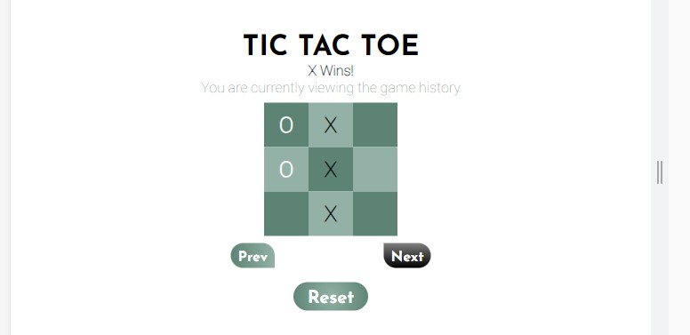
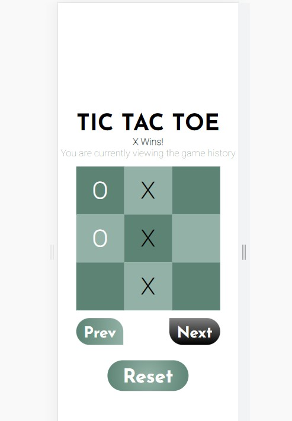

# Avion School Project - Interactive Tic Tac Toe

This is my submission for the Tic Tac Toe project given.

## Table of contents

- [Avion School Project - Interactive Tic Tac Toe](#avion-school-project---interactive-tic-tac-toe)
  - [Table of contents](#table-of-contents)
  - [Overview](#overview)
    - [The Challenge](#the-challenge)
      - [Phase 1:](#phase-1)
      - [Phase 2:](#phase-2)
      - [Notes:](#notes)
    - [Screenshot](#screenshot)
    - [Links](#links)
  - [My Process](#my-process)
    - [Built with](#built-with)
    - [What I learned](#what-i-learned)
    - [Continued Development](#continued-development)
    - [Useful Resources](#useful-resources)
    - [Author](#author)
    - [Acknowledgements](#acknowledgements)

## Overview
### The Challenge

#### Phase 1:
- Create a game of tic tac toe.
- The design and representation and responsiveness of the tic tac toe board in the DOM is up to you.
- The rule of whose turn it is (X or O) must be observed. You can choose whether X or O will play first.
- The "state" of the board should strictly come from a two-dimensional array (In JS, that's array within an array). You may use array built-in methods.

#### Phase 2:
- When a player wins, you must show the history of the game.
- To do that, every move should be "saved".
- Implement (2) buttons, "Previous" and "Next", that will show up when a game is done / finished.
- When clicking "Previous" or "Next", the board should show the current move at that moment / turn.
- If there's no "next move", the next button must be disabled.
- If there's no "previous move", the previous button must be disabled.
- Implement a reset button, that:
    - Restarts the game
    - Hides the "Previous" and "Next" buttons
    - Clears move history

#### Notes:
- Yes - refreshing the page clears the history of the game.
- No - You cannot use any library like React etc. Although you can check them for references.
- No - You cannot use class(objects). Let's be "functional" for now!

### Screenshot




### Links

- Project URL: [Github](https://github.com/smic29/Avion-School/tree/main/Tic%20Tac%20Toe)
- Live Site URL: [Tic Tac Toe](https://smic29.github.io/Avion-School/Tic%20Tac%20Toe/)

## My Process
### Built with

- HTML
- CSS Grid
- Flexbox
- JavaScript

### What I learned

I learned a lot during this project, especially with coding with JavaScript. Certain challenges were met with a few minutes (sometimes hours) of pondering, before finally getting that 'Aha!' moment. 

The first challenge was creating the board, but since we've already done some similar projects, I did the same thing and used a for loop for creating the board, then just added classes to the appended elements to style them on css.

```js
const boardLayout = [
    ['','',''],
    ['','',''],
    ['','','']
];

for (let i=0; i < boardLayout.length; i++){
        for (let j=0; j < boardLayout[i].length; j++){
            const box = document.createElement('div');
            box.classList.add('box');
            ((i+j) % 2 === 0) ? box.classList.add('even') : box.classList.add('odd');
        }
}
 
```

The code above satisfies two of phase 1's requirements, which is to create the game and have the state of the board come from a two-dimensional array. I useed odd and even classes to have each alternating box colored differently to simulate a sort of 3x3 chessboard.

As for the rule of whose turn it is, my initial take was to just do a random number generator for X and O. I'll have the code for this below, but I think I may plan to implement a selection option.

```js
function xOrO() {
    const num = Math.round(Math.random() + 1);
    return num;
}

let whoIsPlaying = xOrO();

function isPlaying() {
    const msg = " IS PLAYING";
    const msgDisplay = document.querySelector('.player');

    (whoIsPlaying === 0) ? msgDisplay.textContent = `X${msg}`: msgDisplay.textContent = `O${msg}`;
}

function nextTurn() {
    (whoIsPlaying === 0) ? whoIsPlaying = 1 : whoIsPlaying = 0;
}
```
So basically, function xOrO will choose between 0 and 1. The whoIsPlaying variable will then call that function to store the result. The isPlaying function uses that variable to determine whether the 'turn' is for 'X' which is 0, or for 'O', which is 1. I could've maybe done this a bit better, but as of writing, this is what I chose to go with. It also ticks the requirement of the rule of whose turn it is. The nextTurn function will then use the whoIsPlaying variable to make sure that when this function is invoked, the next player will always be different.

Now phase 2, this is where I experienced a lot of "let's think for a second" moments. The first requirement of when the player wins, you must show the history of the game, was really challenging. Since I encountered a lot of problems. My base idea was to snapshot each move / click to an arrow of the board layout, but problems arose since when I was trying to access that array, it only saved the latest move. Although, it did have the correct length / move number as the current game, I won't be able to show the moves that led to a win.

```js
export function gameHistory(currentLayout, historyVariable,latestMove) {
    const boardCopy = [];

    for (let i = 0; i < currentLayout.length; i++){
        const row = [];
        for (let j = 0; j < currentLayout[i].length; j++){
            row.push(currentLayout[i][j]);
        }
        boardCopy.push(row);
    }
    historyVariable.push(boardCopy);
    latestMove[0] = historyVariable.length - 1;
}
```
The function above is what I came up with. It is invoked everytime a cell on the board is clicked. It then iterates over the board layout, turns it into an array the resembles the board layout, then finally pushes that into a global variable that stores what the board looked like at specific move numbers. Simply put, it's an array of an array of arrays. 

To visualize:

```js
const moveHistory = [
    [
        //This is the first move of X
        ['x','',''],
        ['','',''],
        ['','',''],
    ],
    [
        //This is the first move of O
        ['x','',''],
        ['o','',''],
        ['','','']
    ]
]
```

I also made the latest move stored in an array. This latest move is the length of the move history minus one. So that I could index it later with next and previous buttons. The reason I chose to store it in a one item array is because declaring it as a number just won't work for me. Like the move history array, this is also a global variable that is initially declared as an empty array.

```js
const gameMoves = [];
let latestMove = [0]; 
//It has a zero in it, so I just need to index the first item to keep changing it.
```

The final part which concerns all the buttons was just as challenging as saving the history, but once I was able to fix saving the history, it became much simpler. 

```js
export function historyBoard(gameMoves,moveIndex){
    let latestMove = moveIndex[0];
    console.log(latestMove < gameMoves.length - 1)
    const gameBoard = document.querySelector('.boardContainer');
    while (gameBoard.firstChild){
        gameBoard.removeChild(gameBoard.firstChild);
    }

    function next(){
        if(latestMove < gameMoves.length - 1){
            latestMove++;
            boardCleanse();
            historyBoardGenerator(gameMoves,latestMove,gameBoard);
            buttonStatus();
        }
    }

    const nextButton = document.querySelector('.next');
    nextButton.addEventListener('click',() => {
        next();
    });

    function prev(){
        if(latestMove > 0){
            latestMove--;
            boardCleanse();
            historyBoardGenerator(gameMoves,latestMove,gameBoard);
            buttonStatus();
        }
    }

    const prevButton = document.querySelector('.previous');
    prevButton.addEventListener('click',() => {
        prev();
    })

    function buttonStatus(){
        if (latestMove === gameMoves.length - 1){
            nextButton.classList.add('disabled-button');
        } else {
            nextButton.classList.remove('disabled-button');
        }

        if (latestMove === 0){
            prevButton.classList.add('disabled-button');
        } else {
            prevButton.classList.remove('disabled-button');
        }
    }

    if (gameMoves.length === 0 || latestMove < 0 || latestMove >= gameMoves.length) {
        return {
          next,
          prev,
        };
      }
    historyBoardGenerator(gameMoves,latestMove,gameBoard);
    buttonStatus();
    setTimeout(displayMessage(),2000);
    
    return {
        next,
        prev,
    }
}
```
The code above mostly contains all the functions utilize by the three buttons. The difference between this function and the one that generates the initial board is that this one doesn't add event listeners to the boxes, so when the game finishes, it erases that initial play board and replaces it with one that just shows the saved history.

This part is where I think I learned the most about the scope of variables, function parameters, and callbacks. Most of which were the recap lessons we've had the night before I actually completed the project or finished all of the requirements. Shoutout to Mikee!

### Continued Development

I think I'll continue to work on this project and style it a bit more to polish my CSS skills, as well as clean up the code if I can. I believe that with more practice and challenges I'd be able to gain a deeper understanding of how I should name my variables. I sometimes just name them on a whim, then regret that decision down the line when I end up having to use that variable on many different functions.

I'll also start practicing writing functions on different files. Having most of the functions in one js file kind of makes it feel cramped and hard to read. I'll use this project to practice that and maybe have all js code organized and just use the main/index one to have the global variables. Maybe lol.

### Useful Resources

- [ChatGPT](https://chat.openai.com) - This is what I mostly used for questions about the code I currently have written. Though, as much as possible, I'd only refer to it like Google. It's important that I know how my code should be, but when I'm really confused and stuck, I'd refer to it and ask how it would write the code. I like treating AI as only an extension of my brain and not think for me.

### Author

- Github - [@smic29](https://github.com/smic29)
- Replit - [@YISStuff](https://replit.com/@YISStuff)

### Acknowledgements

Thanks to my batchmates and mentor, Mikee, at Avion School! The lectures, projects, challenges, and recommendations have really helped me gain more knowledge into web development and I plan to continue learning to improve my skills. 

To my wife and kids, thank you for being my biggest inspiration and challenge when coding. Although I could finish projects at probably half the time, I'd still choose to always do stuff with you guys first. 